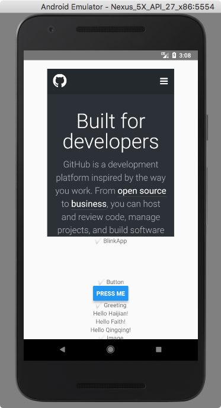
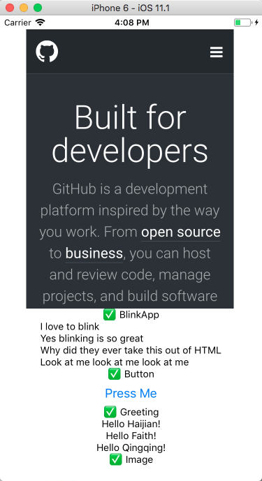

## React-Native learning demo

## Prerequisites

- Android Studio 

[install guide](https://developer.android.com/studio/index.html)

- Xcode 

[install guide](https://developer.apple.com/xcode/)

- Node
```sh
$ brew install node
```

- react-native-cli
```sh
$ npm install -g react-native-cli
```

- watchman
```sh
$ brew install --build-from-source watchman
```

- Set environment variables
```sh
$ vi ~/.bash_profile
export ANDROID_HOME=~/Library/Android/sdk
export PATH=$PATH:$ANDROID_HOME/tools:$ANDROID_HOME/platform-tools

$ source ~/.bash_profile
```

## How to run

- Clone source
```sh
$ git clone https://github.com/cookeem/react-native-demo
cd react-native-demo
```
- Install packages
```sh
$ npm install
```

- Run web server
```sh
$ npm start
 ┌────────────────────────────────────────────────────────────────────────────┐ 
 │  Running Metro Bundler on port 8081.                                       │ 
 │                                                                            │ 
 │  Keep Metro Bundler running while developing on any JS projects. Feel      │ 
 │  free to close this tab and run your own Metro Bundler  instance if you    │ 
 │  prefer.                                                                   │ 
 │                                                                            │ 
 │  https://github.com/facebook/react-native                                  │ 
 │                                                                            │ 
 └────────────────────────────────────────────────────────────────────────────┘ 
```

- Run android emulator
```sh
# get android avd list
$ ~/Library/Android/sdk/tools/emulator -list-avds
Nexus_5X_API_27_x86

# run android avd
$ ~/Library/Android/sdk/tools/emulator -avd Nexus_5X_API_27_x86
```

- Run demo in android emulator
```sh
$ react-native run-android
```


- Run demo ios simulator
```sh
$ react-native run-ios
```


- How to use hot reloading

Open android emulator interface, press `Cmd+M` to show hot reloading menu.

Open ios simulator interface, click top menu: `Hardware -> Shake Gesture` to show hot reloading menu. 
